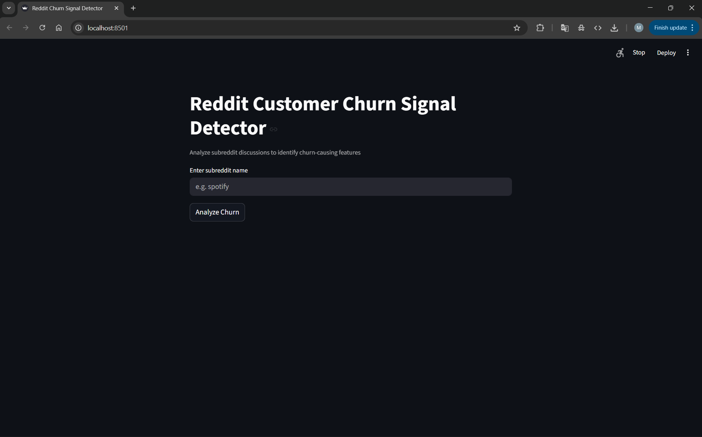
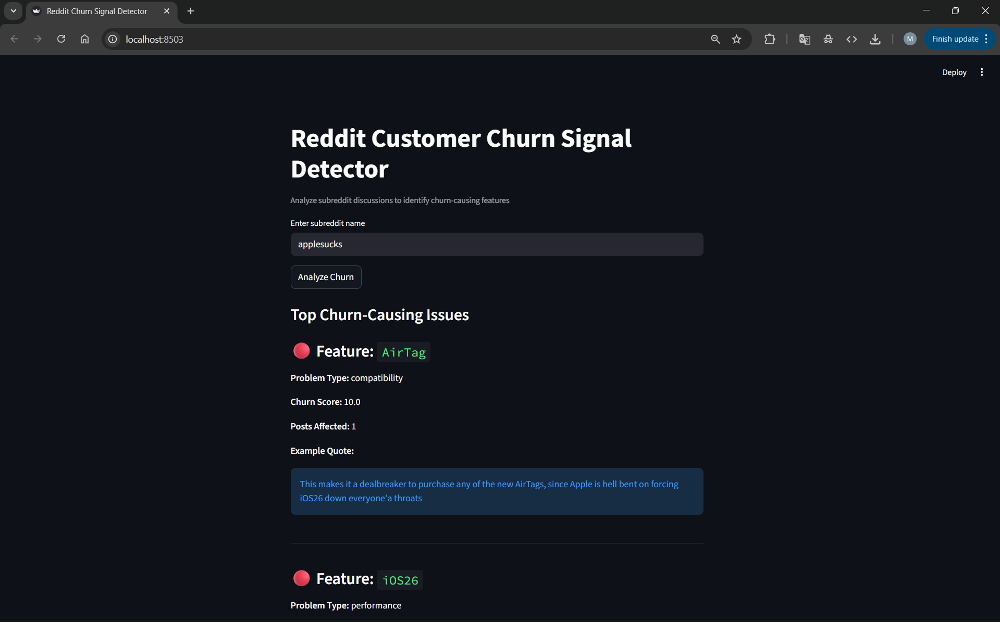

# CHURN - v1.0

_A reproducible, AI-powered customer churn analysis system_

Convert unstructured Reddit discussions into early churn risk signals through a REST API or CLI with LLM-driven sentiment analysis and risk scoring.<br>
A production-grade, modular ML pipeline that uses advanced language models to identify and quantify customer dissatisfaction patterns from Reddit discussions, built with scalability, reliability, and deployment in mind.<br><br>
_A Mini research-to-production pipeline_

<p align="center">
  <table>
    <tr>
      <td align="center" style="border: 2px solid #ddd; padding: 20px; border-radius: 8px;">
        <strong>Input and Loading Stage</strong><br><br>
        
      </td>
      <td align="center" style="border: 2px solid #ddd; padding: 20px; border-radius: 8px;">
        <strong>Final Output Stage</strong><br><br>
        
      </td>
    </tr>
  </table>
</p>

<p align="center">
  <em>CHURN workflow: User input and loading (left) → Churn analysis results (right) for <strong>"Applesucks"</strong> subreddit</em>
</p>

---
## Table of Contents

1. [Overview](#overview) 
2. [Features](#features)  
3. [Note on Analysis Quality](#note) 
4. [Installation](#installation)  
   - [Using Conda](#using-conda)  
   - [Using Python venv](#using-python-venv)  
   - [Deployment](#deployment)  
5. [Project Structure](#project-structure)  
6. [Usage](#usage)  
   - [Running the Streamlit App](#running-the-streamlit-app)  
     - [Local Development](#local-development)  
   - [Running via CLI](#running-via-cli)  
     - [Quick Examples](#quick-examples)  
     - [Key CLI Parameters](#key-cli-parameters)  
7. [Configuration](#configuration)  
   - [Configuration Parameters Explained](#configuration-parameters-explained)  
     - [Product Settings](#product-settings)  
     - [Reddit Settings](#reddit-settings)  
     - [Fetch Parameters](#fetch-parameters)  
   - [Performance Tuning Tips](#performance-tuning-tips)  
8. [License](#license)

---

## Overview

CHURN v1.0 exists to make the process of identifying customer churn risks from social media discussions accessible and automated. It wraps around an advanced LLM analysis pipeline, exposes it through a production-ready Streamlit web interface, and also provides a command-line interface for batch and local workflows.

The motivation behind this system is to provide early warning signals for customer churn by analyzing real user discussions in real-time. While the analysis is not a substitute for comprehensive customer surveys, it serves as a valuable early indicator that can trigger proactive customer retention strategies. This removes the need to wait for formal feedback channels and allows more focus on immediate issue resolution.

**Production-Grade Design Highlights**
- **Scalable analysis pipeline** with asynchronous LLM processing to handle large discussion volumes without blocking.
- **Modular architecture** separating data ingestion, LLM analysis, scoring, and presentation layers.
- **Config-driven execution** via YAML, enabling reproducible runs and easy tuning for different products.
- **Structured logging** for both web interface and CLI pipelines to aid monitoring and debugging.
- **Multi-interface support**: Streamlit web app for interactive use, CLI for scripting/batch jobs.
- **Stateless analysis** — scalable horizontally behind a load balancer  
- Minimal external dependencies for easier deployment  
- Risk scoring system with normalized 0-10 scale for easy prioritization

---


## Features

### Built for Production CHURN v1.0 can:
* Analyze Reddit discussions for churn-causing issues using advanced LLM
- Extract issues in multiple categories: **bug**, **UX**, **pricing**, **performance**, **support**, **policy**, **feature_removal**, **product_quality**  
- Provide both **Streamlit web interface** and **CLI** workflows  
- Support **asynchronous LLM analysis** with structured job execution  
* Offer normalized risk scoring (0-10) with severity classification
* Support extensive CLI flags for controlling subreddits, keywords, and analysis parameters
* Save all raw data and results in organized directories with clear file naming
- Comprehensive logging for both web interface and pipeline processes for monitoring and debugging
- Handles **parallel discussion analysis** without blocking other requests.
- Fully **stateless analysis design**—can be scaled horizontally behind a load balancer.
- Output **directory isolation per run** to prevent conflicts.
- Minimal external dependencies to reduce deployment friction.
- Config-driven execution with reproducible analysis characterization

### Note 
> The quality of churn signal detection depends on the availability and quality of Reddit discussions about your product. Outputs from this system are indicators of potential churn risk and should be combined with other customer feedback channels for comprehensive analysis. This is an advantage over traditional surveys, as you get real-time, unfiltered customer sentiment that can trigger immediate action.

While CHURN's architecture is production-ready, final analysis accuracy depends on the underlying LLM model, discussion volume, and integration with your customer support workflows.


---

## Installation

It is recommended to set up CHURN in an isolated Python environment using either Conda or venv.

### Using Conda:

```bash
conda create -n reddit_churn python==3.10 -y
conda activate reddit_churn
pip install -r requirements.txt -q 
```

### Using Python venv:

```bash
python -m venv reddit_churn_env
source reddit_churn_env/bin/activate   # On Linux or macOS
reddit_churn_env\Scripts\activate      # On Windows
pip install -r requirements.txt
```
- Ensure that you have Python 3.10 installed as this is the recommended version for compatibility with all dependencies.

### Environment Setup
Create a `.env` file with your API credentials:

```bash
REDDIT_CLIENT_ID=your_reddit_client_id
REDDIT_CLIENT_SECRET=your_reddit_client_secret
REDDIT_USER_AGENT=your_app_user_agent
GROQ_API_KEY=your_groq_api_key
```

### Deployment
CHURN is designed for easy deployment in both development and production environments.
- **Docker-ready** (coming soon) for reproducible builds.
- Supports **cloud platform deployment** (AWS, GCP, Azure) and on-prem.
- Compatible with **Kubernetes scaling patterns** for serving multiple analysis jobs in parallel.

---
## Project Structure

```
reddit-churn-sig/
├── streamlit/
│   └── app.py                     # Streamlit web interface
│
├── core/
│   ├── ingestion/                 # Reddit data collection
│   │   ├── reddit_client.py       # Reddit API client setup
│   │   ├── fetch_posts.py         # Post fetching logic
│   │   └── fetch_comments.py      # Comment fetching logic
│   │
│   ├── data_processing/           # Data preprocessing
│   │   ├── save_raw.py           # Raw data storage
│   │   └── preprocessing/
│   │       ├── discussions.py     # Discussion building
│   │       ├── formatting.py      # Text formatting for LLM
│   │       └── chunk_discussions.py  # Text chunking
│   │
│   ├── llm_extraction/            # LLM analysis
│   │   ├── groq_client.py        # Groq API client
│   │   └── extract_signals.py    # Churn signal extraction
│   │
│   └── scoring/                   # Risk scoring
│       ├── aggregrate_signals.py  # Issue aggregation
│       └── compute_risk_score.py  # Risk score calculation
│
├── utils/
│   ├── config/
│   │   └── reddit.yaml           # Configuration file
│   └── logging/
│       └── logger.py             # Logging setup
│
├── data/
│   └── raw/                       # Raw Reddit data storage
│   └── processed/                 # Processed data storage
│
├── sample/
│   ├── Input_sample.png           # Input and loading stage screenshot
│   └── Output_sample.png          # Final output stage screenshot
│
├── app.py                         # Streamlit entry point
├── main.py                        # CLI entry point
├── pipeline.py                    # Shared analysis pipeline
├── requirements.txt               # Python dependencies
├── .env.example                   # Environment variables template
├── .gitignore                     # Git ignore rules
└── README.md                      # Main project documentation
```
---
# Usage

## Running the Streamlit App

### Local Development

Start the Streamlit web interface:

```bash
streamlit run app.py
```

After startup, the application will be available at:
- **Web Interface**: [http://localhost:8501](http://localhost:8501)

The web interface provides:
- Subreddit input field
- Real-time analysis progress
- Interactive results display
- Risk score visualization

## Running via CLI

### Quick Examples

```bash
# Run with default configuration
python main.py
```

## Configuration

CHURN uses `utils/config/reddit.yaml` for runtime configuration. Modify these settings to tune analysis behavior and data collection parameters.

### Configuration Parameters Explained

#### Product Settings
- **`product.name`**: Product identifier for analysis context
- **`product.description`**: Product description for LLM context

#### Reddit Settings
- **`reddit.subreddits`**: List of subreddits to monitor (default: applesucks, apple)
- **`reddit.keywords`**: Churn-related keywords to filter discussions

#### Fetch Parameters
- **`reddit.fetch.post_limit`**: Maximum posts per subreddit (default: 100)
- **`reddit.fetch.comment_limit`**: Maximum comments per post (default: 200)
- **`reddit.fetch.max_comment_depth`**: Maximum comment depth to analyze (default: 5)
- **`reddit.fetch.sort`**: Post sorting method (new, hot, top)
- **`reddit.fetch.time_filter`**: Time window for posts (day, week, month, year, all)

### Performance Tuning Tips

**For Faster Analysis:**
- Reduce `post_limit` to 50 or fewer posts
- Set `comment_limit` to 100 or fewer comments
- Limit `max_comment_depth` to 3 levels

**For Comprehensive Analysis:**
- Increase `post_limit` to 200+ posts
- Set `comment_limit` to 500+ comments
- Use longer `time_filter` (year, all)
- Monitor multiple relevant subreddits

**For Targeted Analysis:**
- Focus on specific subreddits where your customers are active
- Customize keywords for your product domain
- Use recent `time_filter` for current issues

> See `PERFORMANCE.md` for empirically measured analysis times and resource usage across configurations.

---
## License

This project is licensed under the MIT License.

You are free to:

• Use, modify, and distribute this software for personal, academic, or commercial purposes  
• Clone it for research, testing, or improvement  
• Run it locally or in production environments  

You must:

• Include the original copyright and license notice in all copies or substantial portions of the software  

You cannot:

• Hold the authors liable for any damages arising from the use of this software  

This project makes use of third-party libraries with their own licensing terms:
- **PRAW**: Reddit API wrapper (BSD License)
- **Groq**: API client (Apache License 2.0)
- **Streamlit**: Web interface (Apache License 2.0)

For the full license text, see the `LICENSE` file in this repository.
